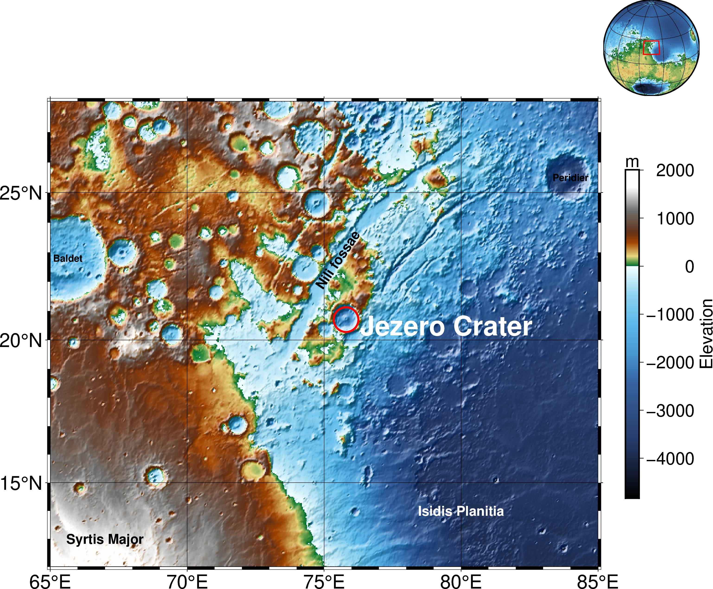

# Planetary Maps (in PyGMT)

 

History: 
- **June 2022**: The repository now includes the `mola32.nc` file, along with a 3D map of *Valles Marineris* and a map of Jezero Crater.
- **August 2023**: New ideas are being explored, with a focus on mapping Europa. [Read more here](https://www.planetary.org/articles/0218-mapping-europa).
- **April 2024**: Upgraded to the latest version of `pygmt`.
- **July 2024**: The `binder` option has been removed due to slow performance; additional updates applied.
- **November 2024**: Full update of all package versions, featuring `pygmt` 0.13.0.

Some other experiments, bonus maps and more tutorials geared towards some planets and moons in our solar system will be here soon. 

If you are in a hurry, you can jump directly to the colab version here. Just follow the instructions in the notebook.  

Reference: 
Tian, Dongdong, Uieda, Leonardo, Leong, Wei Ji, Schlitzer, William, Fröhlich, Yvonne, Grund, Michael, Jones, Max, Toney, Liam, Yao, Jiayuan, Magen, Yohai, Jing-Hui, Tong, Materna, Kathryn, Belem, Andre, Newton, Tyler, Anant, Abhishek, Ziebarth, Malte, Quinn, Jamie, & Wessel, Paul. (2023). PyGMT: A Python interface for the Generic Mapping Tools (v0.10.0). Zenodo. https://doi.org/10.5281/zenodo.8303186. 

